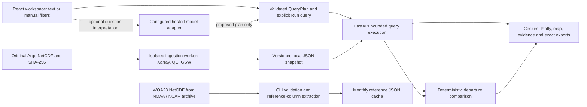

# FloatChat requirements audit

Engineering audit dated 20 September 2026. This is a record of the implementation and its evidence, not a submission deck or a claim that every requirement is complete.

## Source hierarchy

- Official current event website and rulebook: https://orion-hackathon-26.vercel.app/ and https://orion-hackathon-26.vercel.app/terms (checked 20 September 2026).
- User-provided ORION-PS-01 screenshot: explicit Round 1 deliverables and scientific deliverable focus.
- FloatChat_Ocean4D_Documentation (1) (1).pdf, 41 pages: team proposal. Page 3 explicitly marks architecture and experiments as proposed. Pages 5, 19–20, 29 and 37 describe acceptance goals, not completed results. Embedded prompts are reference material, not instructions executed by this audit.
- Implementation and evidence: source files, tests, docs/verification.md and local verification artifacts.

## Requirement-to-evidence matrix

| Requirement | Origin | Status | Evidence and remaining acceptance |
|---|---|---|---|
| Real Argo NetCDF ingestion | Explicit Round 1 criterion | Verified at bounded scope | 45 profiles, three INCOIS floats; mode-aware selection, QC and source hashes; ingestion/profile/refresh tests. On-demand recent cycles, not global discovery or streaming. |
| Natural-language multi-variable geospatial/time queries | Explicit Round 1 criterion | Partial | Typed plan, provider adapters, visible review, manual execution and local parser tested. No recorded successful Gemini end-to-end semantic evaluation. Configured label is not connectivity proof. |
| Interactive WebGL 4D portal | Explicit Round 1 criterion | Implemented; prior browser evidence | Cesium position/depth view, recorded-time replay, exaggeration labels and 2D fallback. No fresh full-session WebGL rehearsal during this audit; render latency/FPS not benchmarked. |
| Low-latency retrieval architecture and diagram | Explicit Round 1 criterion | Partial | Current implementation documented below; offline stage timings measured. HTTP/AI/render latency and scale remain unmeasured. Team must independently create submission architecture material under event rules. |
| Thermocline and salinity-gradient sections | Dossier focus | Verified exploratory method | Consecutive-level finite differences, gap limits, observed time/distance sections and endpoint evidence. Strongest cooling interval is a candidate, not a validated thermocline boundary. |
| Ocean anomaly detection | Dossier focus | Partial relative to broad wording | Real monthly WOA23 departures: 5,873 matched variable values independently checked against original NetCDF. No significance test or event detector. |
| Marine heatwaves | Dossier focus | Missing | No daily SST series, seasonal percentile threshold, persistence/event-joining algorithm or validation. Monthly subsurface departures do not satisfy this. |
| Multimodal semantic engine | Track title/context | Missing input capability | Text/manual query input only. Multiple visual outputs do not constitute multimodal input. No image/voice ingestion. |
| Forecasting | Track overview; 90 days is team proposal | Missing | No defined target/evaluation, persistence/seasonal benchmarks, rolling-origin results or calibrated intervals. Do not generate forecast values without those gates. |
| Period comparison / ocean memory | Team proposal | Partial | Two-profile nearest-depth comparison and saved query plans/snapshot archives implemented. No complete two-period spatially matched aggregation workflow. |
| Evidence and exports | Team proposal/core trust goal | Verified | Argo/WOA sources, hashes, original levels, exact JSON/CSV, ranked export and printable HTML reports. PDF print pagination not separately tested. |
| Robustness analysis | Team differentiator | Partial | QC policy comparison and explicit depth tolerances; no broad sampling-policy ablation study. |
| Zarr + PostGIS + vector RAG | Proposed/recommended stack | Not implemented | JSON snapshots/reference columns and Python scans. No spatial SQL index, chunked Zarr store or vector retrieval. Do not label the current app with these technologies. |
| Production deployment and security | Release readiness | Not complete | Loopback local app, one API process, bounded queries. No deployed public service, accounts, rate limits or multi-worker ingestion coordination. |
| User benefit / superiority | Proposal research goals | Unverified | No user study, timed task comparison or competing-portal benchmark. Avoid claims of best accuracy or quantified time savings. |

## Current architecture: engineering record

There is no Zarr/PostGIS deployment behind this diagram. NetCDF parsing is isolated from the API; normal queries read JSON. The model does not calculate measurements or execute arbitrary code. Scientific gradients and several presentation analyses currently run in the browser; query/QC/climatology calculations run in Python. This record is AI-assisted engineering documentation; do not paste it into the restricted submission deck as original team work.

## Measured offline performance

Reproduce with `.venv\Scripts\python.exe scripts/benchmark_offline.py --runs 20`. Full settings, individual samples and platform are recorded in artifacts/offline-benchmark.json. Windows 11, Python 3.12.14, Intel64 Family 6 Model 154; snapshot argo-710442466244, reference 60d00b8b5cd66e9d. One warm-up then 20 sequential runs over 45 profiles / 3,680 retained levels. p95 uses nearest-rank percentile.

| Stage | Median ms | p95 ms |
|---|---:|---:|
| Snapshot file read + JSON decode | 9.302 | 11.560 |
| Query + quality audit | 9.768 | 21.595 |
| Reference file read + JSON decode | 8.153 | 9.985 |
| Departure comparison | 61.062 | 63.660 |
| Serialize query and departure evidence | 44.442 | 49.153 |

Serialized output was 4,451,588 bytes with the benchmark's JSON serializer. This is not a wire-size measurement. These are independent stage measurements, not additive percentile guarantees. Excludes HTTP, hosted model, network downloads, cold OS cache and browser rendering. No inference about global-scale performance is supported.

## Priority order to finish

1. Team reviews current event rules and independently prepares the required template. Official site lists Round 1 deadline 21 September 2026, 23:59 IST; dates can change. This is more urgent than adding small UI features.
2. Gemini checks resumed after user steering. The local API is healthy, but the provider diagnostic returned HTTP 503 (high demand); one bounded retry also fell back. The new evaluation records fallback separately from AI success. All 12 offline development cases pass; live semantic evaluation remains incomplete. See interpreter-evaluation.md.
3. Rehearse the full demo on the presentation laptop: fresh launch, manual query, WebGL/fallback, source lookup, climatology, exports. Record actual HTTP and time-to-usable-view timings separately from the offline benchmark.
4. Decide scope against organizer expectations: disclose missing multimodal input, daily-SST heatwave detection and forecast evaluation. Implement these as separate validated capabilities if required; do not rename existing charts to imply compliance.
5. Prepare a deployment target only after deciding access controls, budgets and ingestion/storage strategy. Existing local startup is the supported demo path.

## Submission cautions grounded in current rules

Official rulebook: one final PPT, prescribed template, Team ID left blank, and at least 90% original human deck work with AI limited to light proofreading. The finale assigns its problem on site; prebuilt work must not be represented as created during that event. AI-assisted coding is allowed, but team members must understand and defend it. Existing AI-assisted blueprint and walkthrough are internal preparation material, not automatically compliant slide content. No submission, registration or communication with organizers was performed.

## Audit execution limits

Read the original PDF, event pages and repository. Corrected stale README scope statements. Ran the offline benchmark only; it invokes no network or LLM. Earlier tests/build/browser checks are historical evidence in docs/verification.md, not newly rerun results. A local API readiness/status call was not executed because automatic approval review hit a usage limit. No alternate route was used to bypass that rejection. Gemini credentials and running API environment remain unchanged.

### Follow-up verification, 20 September 2026

The earlier approval-limit block was resolved on the subsequent turn. Health and assistant status requests succeeded. A Gemini diagnostic and one bounded retry produced local fallback; no credentials were exposed or configuration changed. Added a repeatable interpretation evaluation and explicit adapter validation-error metadata. Targeted assistant/query/evaluation tests: 68 passed. See interpreter-evaluation.md and artifacts/interpreter-offline-evaluation.json / interpreter-live-evaluation.json. These checks supersede the earlier live-check limitation, not the missing live AI semantic evidence.
